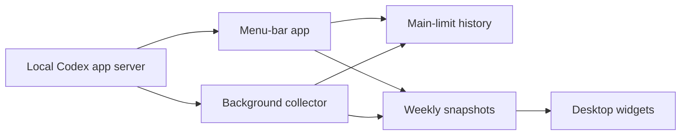

<h1 align="center">Codex Limits</h1>

<p align="center">
  <strong>Know whether your Codex limit will last until reset.</strong>
</p>

<p align="center">
  A native macOS menu-bar app and desktop widgets for tracking your Codex limits, usage history, and sustainable pace.
</p>

<p align="center">
  <a href="https://github.com/NSErfan/codex-limits/actions/workflows/ci.yml"></a>
  
  
  <a href="LICENSE"></a>
</p>

<p align="center">
  
  <br>
  <sub>Earlier dashboard layout. Current builds also include history tabs, banked-reset pacing, and widget previews.</sub>
</p>

> [!NOTE]
> Codex Limits is an independent, unofficial project. It is not affiliated with or endorsed by OpenAI.

> [!NOTE]
> This is an independently developed fork of [thrr87/codex-limits](https://github.com/thrr87/codex-limits), released under the same MIT license. It follows its own direction and does not track the original.

## What it tells you

Codex shows how much usage remains. That number does not tell you whether it will last. Codex Limits compares your use with the time left before reset.

Open the menu to see:

- The percentage left in the main Codex window with the lowest remaining percentage, also shown in the menu bar. This can be the five-hour or weekly window.
- A status: `Slow down`, `On track`, or `Room to use more`.
- A suggested hourly or daily pace.
- Current and past use plotted against the target.
- Other reported limits and available banked resets.

Desktop widgets always show the weekly limit, so their percentage can differ from the menu bar.

## How to read the charts

Choose **Window** for the current limit's forecast:

- **Target** runs from 100% to empty at the pacing deadline.
- **Actual** shows recorded percentage samples. Before those cover the window, daily token totals can estimate the earlier part of the curve.
- **Current** projects a blend of recent, current-window, and historical use toward the pacing deadline, or until the balance reaches zero.
- **Today** projects today's observed pace to the scheduled window reset. It appears when the app can measure consumption today and excludes the observed idle period before usage began.
- **Historical** projects the pace from earlier usage toward the pacing deadline.

Suggested pace reserves a safety buffer, 3% by default, which you can change in Settings. The drawn **Target** line ends at zero; the buffer affects the recommendation and status calculation.

In **Settings → Appearance**, choose an accent preset or a custom color for the app, graphs, and both widgets. Presets adapt to light and dark appearance. Foreground colors adjust for readability, including black and white custom colors, while the picker and background tint retain your selection. **Automatic** keeps the balance-based mint, amber, and coral colors; warning text retains its warning color with any selection. Changes are saved locally and request a widget refresh, which macOS schedules.

Choose **7 days** for a scrollable week of recorded history or **30 days** for the full month. Hover over charts for percentages and times. History views mark detected resets and distinguish gaps in recorded samples.

When Codex reports banked resets, select an eligible reset from the **Banked resets** menu or its chart marker to pace toward its expiry. Select it again to return to the scheduled reset. This changes the pacing calculation; it does not redeem the reset. The **Today** line and desktop widgets continue to use the scheduled window reset.

## Features

- Shows the main Codex limit and model-specific limits.
- Saves main-limit history and a separate weekly history for widgets.
- Estimates the percentage left at reset from current and past use.
- Keeps up to 90 days of main-limit history in versioned daily JSON files, with 7-day and 30-day chart views.
- Can copy history to a private folder that you choose.
- Refreshes on launch, after wake, when you open the menu, every ten minutes, or on request.
- Retries transient read failures automatically and preserves the last successful reading and cached history.
- Can collect usage on a 15-minute schedule while the menu-bar app is closed.
- Runs as a native SwiftUI menu-bar app with no third-party runtime dependencies.
- Includes two native desktop widgets: a small weekly percentage and a medium weekly usage graph.

## Background collection

In Settings, **Collect usage while the app is closed** controls a bundled background helper. On first app launch, Codex Limits attempts to register it automatically; macOS may require approval in **System Settings → Login Items**. Settings reports when approval is needed or registration fails.

The helper runs a single collection on a 15-minute schedule, writing main-limit history and weekly widget data. The menu-bar app continues to refresh on its own ten-minute schedule. Background execution depends on macOS scheduling and the Codex CLI being available; it is not continuous polling while the Mac sleeps.

Install the app in `/Applications` before enabling background collection, since registration uses the app bundle's location. **Launch at login** is a separate setting for the menu-bar app.

## Desktop widgets

**Weekly Percentage** shows the percentage of your weekly Codex limit remaining,
with a segmented balance indicator. **Weekly Graph** adds the current week's
recorded usage curve, an even-pace guide, and time until reset. Both adapt to light
and dark appearance, with amber and coral accents at 25% and 10% remaining.

These widgets always use the seven-day `codex` limit, even when the menu bar's most
constrained limit is the five-hour window. They keep their own weekly readings;
the dashed chart guide is a straight line from 100% to 0% at the scheduled reset,
independent of the dashboard's forecast and banked-reset pacing settings.
Weekly history begins when you first run a build with widget support. Older dashboard history cannot be imported
reliably because it mixes five-hour and weekly readings without identifying them.
Until there are two weekly readings, the graph says **Collecting history**.

Open **Preview widgets** (the overlapping rectangles button in the menu) to see
both designs with your usage. Before the first reading, the gallery clearly labels
synthetic sample data. To add an installed widget, Control-click your desktop,
choose **Edit Widgets**, and search for **Codex Limits**. Use the installed build
in `/Applications`; if the gallery was already open during an update, close and reopen it.
Ad-hoc builds also record weekly history locally for the preview gallery.

### Signing for desktop data sharing

The default ad-hoc build compiles and embeds the WidgetKit extension and supports
the in-app preview gallery. Sharing real readings with the sandboxed desktop
extension requires an Apple code-signing identity. Build with:

```sh
DEVELOPMENT_TEAM=YOURTEAMID \
CODE_SIGN_IDENTITY="YOUR_CERTIFICATE_SHA1" \
Scripts/install-app.sh
```

Use your actual Apple Developer Team ID and the certificate SHA-1 (or full identity
name) listed by `security find-identity -v -p codesigning`. The identifier in
parentheses at the end of a certificate's name is not necessarily its Team ID;
the certificate's Organizational Unit (`OU`) identifies the team. The build checks
that `DEVELOPMENT_TEAM` matches the signed extension's team. It gives both bundles
the same team-prefixed macOS App Group,
which [Apple supports without a provisioning profile](https://developer.apple.com/documentation/xcode/accessing-app-group-containers).
The same environment variables work with `Scripts/build-app.sh` and
`script/build_and_run.sh`. Launch the signed app and let it refresh before adding
the widgets. Ad-hoc builds show an empty state in the desktop widget instead of
pretending preview data is live account usage.

To keep subsequent builds and the Run button signed, you can save the identity
name (or certificate SHA-1) under `CodeSignIdentity` and the team ID under
`DevelopmentTeam` in a local `.env.signing.plist` dictionary. This file is ignored
by Git; explicit environment variables override it. It contains identifiers only,
and the private signing key remains in Keychain.

The app and the existing background collector publish small, atomic JSON snapshots
to the group container. Widgets never launch the CLI or access credentials. Each
writer owns a separate file; the extension merges readings from the current weekly
cycle. The app requests a widget reload after a successful fetch, and the extension
requests a refresh after 15 minutes. macOS controls actual delivery times. Readings
older than 30 minutes are marked as last known; when the reset arrives, the old
percentage is hidden until another successful fetch. Without the app or background
collector running, the widget cannot fetch fresh usage by itself.

Render the production SwiftUI views with synthetic data for visual inspection:

```sh
Scripts/render-widget-previews.sh
```

Images are written to `.build/widget-previews/`, including light/dark variants,
full, low, empty, stale, expired, and unavailable states.

## How it works

1. Codex Limits starts your installed Codex CLI and reads usage through its local app server.
2. It saves percentage samples on your Mac. Daily token history supplies data for the first forecast.
3. It calculates a sustainable pace toward the scheduled reset or a selected banked reset's expiry, reserving your chosen buffer.
4. It shows a status and suggests how much you can use per hour or day.

Forecasts improve as the app records more samples. They are estimates, not guarantees.



## Privacy

Codex Limits keeps usage data on your Mac:

- It does not copy or store your Codex credentials.
- It sends no telemetry or analytics. It has no notifications or direct network client.
- It stores main-limit samples in the app's Application Support directory.
- Signed builds share weekly percentages, observation/reset times, and the selected accent color with the widget extension through a local App Group container. Ad-hoc builds keep weekly data beside local history for the preview gallery.
- If you enable history sync, it copies only usage samples to the selected folder. Preferences, credentials, and raw Codex responses stay on your Mac.
- Synced JSON files contain observation times, remaining percentages, and reset times. Choose a folder that you do not share with other people.
- Folder sync covers main-limit history; the separate weekly widget history does not sync between Macs. Use a sync folder only on Macs signed into the same Codex account.
- The Codex CLI may contact the Codex service as part of its normal operation.

Do not attach raw CLI output or screenshots containing account usage to public issues.

## Requirements

- macOS 14 or later
- Xcode 16.4 or later
- A signed-in, Homebrew-managed Codex CLI at `/opt/homebrew/bin/codex` or `/usr/local/bin/codex`

Codex Limits does not use a Codex binary bundled with another app. Install and update the standalone CLI yourself.

## Build from source

Clone the repository. To build, install into `/Applications`, and launch:

```sh
Scripts/install-app.sh
```

For live desktop widget data, configure developer signing as described above before
installing. Without signing configuration, builds use ad-hoc signing and support
the menu-bar app and in-app widget previews.

To build without installing:

```sh
Scripts/build-app.sh
open ".build/release/Codex Limits.app"
```

The default output is `.build/release/Codex Limits.app`; `CONFIGURATION=debug`
selects `.build/debug/Codex Limits.app`. The Codex Run button uses
`script/build_and_run.sh`, which rebuilds and launches the debug bundle. Re-run
`Scripts/install-app.sh` to update the copy in `/Applications`.

Open `Package.swift` in Xcode to work on the app and shared widget views. The build
script also builds `Widgets/CodexLimitsWidgets.xcodeproj` as a native app-extension
target, supplying the entry point needed for macOS to load the widget gallery.
Building the Swift package alone does not package the desktop extension.

The project does not provide a prebuilt or notarized app.

## Test

```sh
swift test
```

The tests use synthetic usage data. Do not commit exported account data or local app state as fixtures.

## Current limitations

- You must build the app from source.
- The forecast needs local samples to improve.
- Codex CLI responses may change between versions. If parsing fails, update the CLI before reporting a problem.

## Security

Report vulnerabilities privately. See [SECURITY.md](.github/SECURITY.md) for instructions.

## License

MIT. See [LICENSE](LICENSE).
