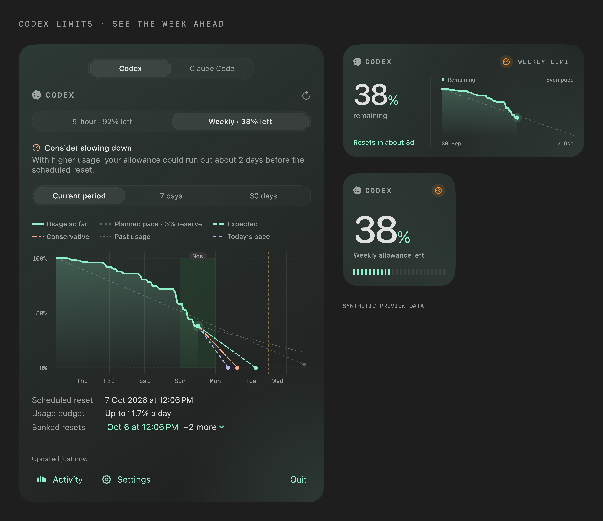
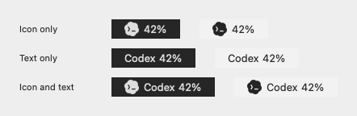
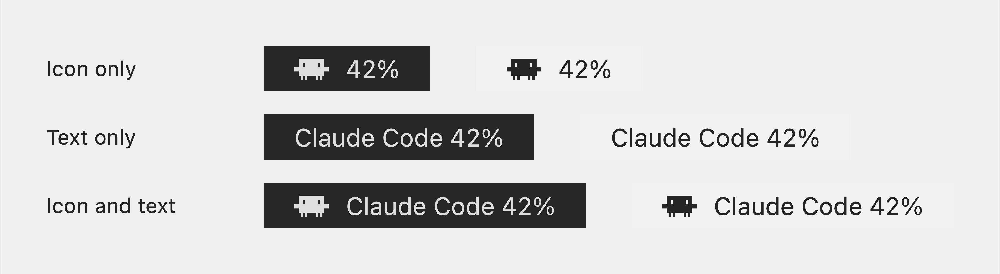
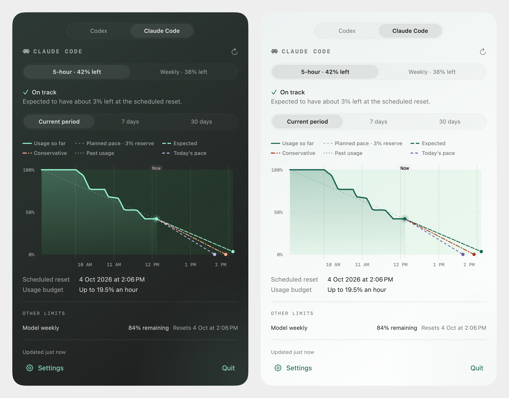
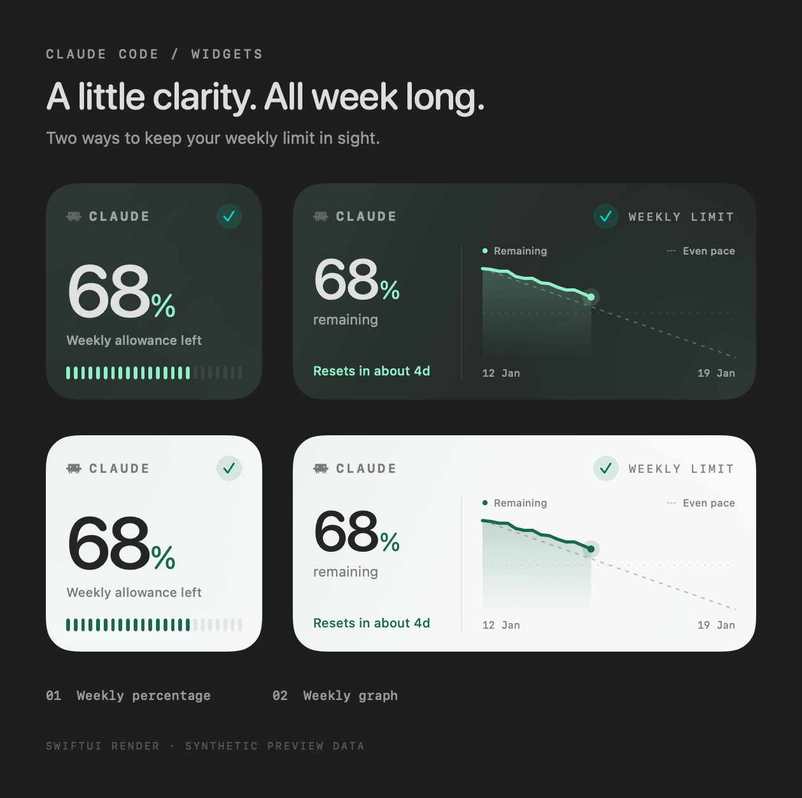
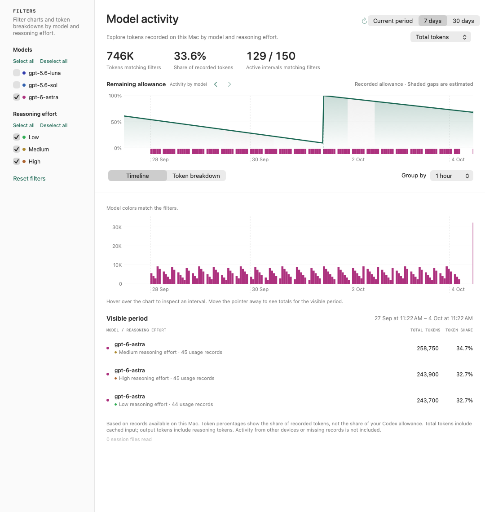
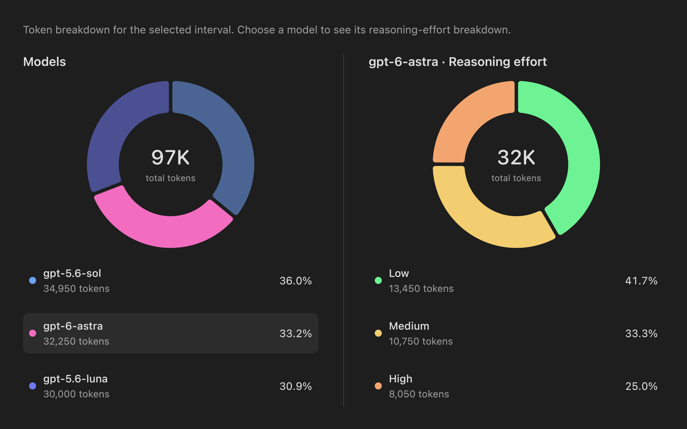
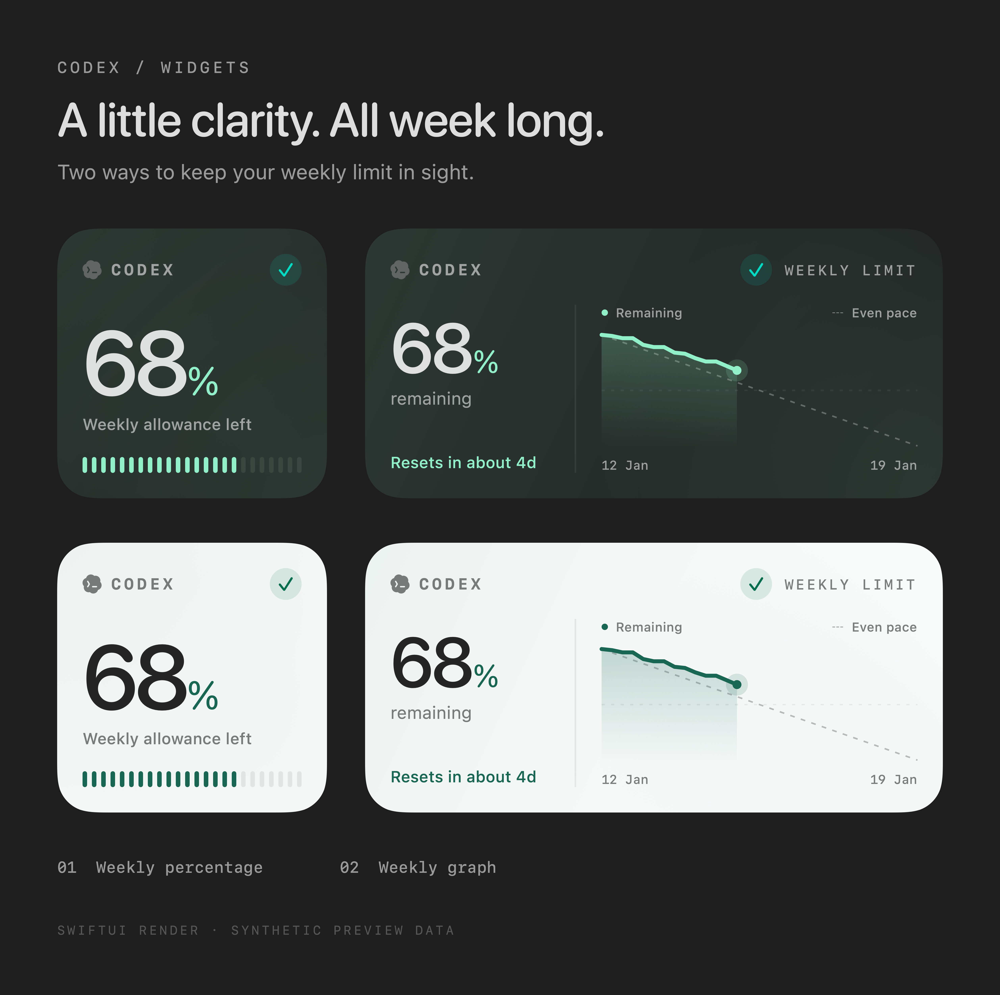
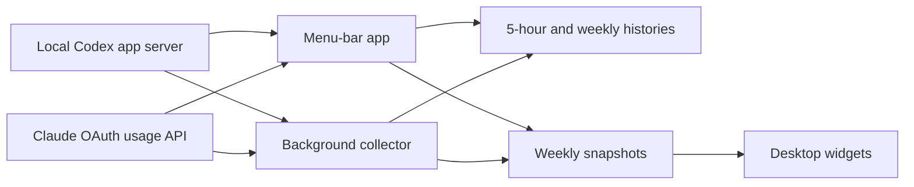

<h1 align="center">Codex Limits</h1>

<p align="center">
  <strong>Know whether your Codex and Claude Code limits will last until reset.</strong>
</p>

<p align="center">
  A native macOS menu-bar app and desktop widgets for tracking your Codex and Claude Code limits, usage history, and sustainable pace.
</p>

<p align="center">
  <a href="https://github.com/NSErfan/codex-limits/actions/workflows/ci.yml"></a>
  
  
  <a href="LICENSE"></a>
</p>

<p align="center">
  <a href="docs/images/menu-and-widgets.png"></a>
  <br>
  <sub>A busier week: uneven work sessions leave 38% remaining, but the forecast warns it may not last until reset. Dashboard and widgets use the same synthetic readings.</sub>
</p>

> [!NOTE]
> Codex Limits is an independent, unofficial project. It is not affiliated with or endorsed by OpenAI or Anthropic.

> [!NOTE]
> This is an independently developed fork of [thrr87/codex-limits](https://github.com/thrr87/codex-limits), released under the same MIT license. It follows its own direction and does not track the original.

## Codex and Claude Code

Use the selector at the top of the menu to switch between **Codex** and **Claude Code**.
The menu bar shows the selected provider’s monochrome product icon and usage percentage by default.
Choose **Icon only**, **Text only**, or **Icon and text** in **Settings → Appearance → Menu bar**.
The percentage is always visible; this setting controls the provider icon and name. It applies to both
providers and is saved across launches. [Icon sources and attribution](docs/provider-icons.md).
Both providers refresh independently,
with separate saved readings, history, chart preferences, and weekly widgets. Your existing
Codex history stays in place.

<details>
<summary>Menu-bar appearance options</summary>
<p align="center">
  <a href="docs/images/menu-bar-codex.png"></a>
  <br>
  <a href="docs/images/menu-bar-claude.png"></a>
  <br>
  <sub>SwiftUI label previews with synthetic percentages. Choose a style in Settings → Appearance → Menu bar.</sub>
</p>
</details>

The provider, usage-window, and chart-range selectors share a subtle segmented style.
The **5-hour** and **Weekly** segments show both remaining balances together. Select
either segment to switch the detailed chart, forecast, and usage budget to that window;
hover for its reset time. The app remembers your selection and chart settings separately
for each provider and period. Switching windows uses saved readings without making
another usage request. If either provider omits its five-hour window, the entire
usage-window selector is hidden and a large weekly percentage appears above the weekly
chart. Expired weekly readings are labeled **last weekly reading**. An unavailable
weekly window says **Not reported** when the selector is shown.
After a window resets, its saved balance is labeled **(last)** and pacing waits for a
new reading; its recorded history remains available.

Claude Code uses your existing CLI sign-in. On macOS the app reads its OAuth credentials
from Keychain, with the CLI credentials file as a fallback. Choose **Refresh** if macOS
needs your permission to read the login. Switching providers, opening a widget’s usage
window, returning from sign-in, and automatic or background refreshes never open Keychain
permission dialogs. If access needs approval, the app keeps the last reading and asks
you to click **Refresh**. macOS’s **Always Allow** applies to the current Keychain item
and app identity; replacing the credential item or changing the app’s signing identity
can require approval again. The app respects `CLAUDE_CONFIG_DIR` when present in its environment.

If sign-in is needed, use **Sign in** in the menu or **Settings → Accounts**. The app opens
Terminal with the provider's official CLI login command. Complete that flow, then return
to the app and refresh. Expired Claude credentials are renewed through Claude Code;
Codex Limits does not rotate or rewrite the CLI's tokens. Claude usage requires a
claude.ai subscription login with usage access; API-key-only and inference-only tokens
are not supported.

**Settings → Accounts** shows the email associated with each provider's last usage
reading and when that reading was fetched. Cached readings retain their original
account email. Older readings or logins without account metadata show **Email unavailable**
until a new reading includes it. Email addresses stay in local app state; they are not
included in shared history or widget data.

Claude requests are spaced at least **15 minutes apart**, shared by the menu app and
background collector for the same CLI profile on this Mac. Opening the menu, waking
the Mac, and pressing Refresh reuse the saved reading during that interval. After a
rate-limit response, the app respects `Retry-After`; when no valid deadline is supplied,
it waits 30 minutes, then 60 minutes, then up to two hours after consecutive failures.
The saved cooldown survives relaunches, and the menu and Accounts show when another
check is available. Manual Refresh cannot bypass it. These are conservative local
defaults, not a published Anthropic polling allowance.

Claude shows account-wide five-hour and seven-day quotas, plus model-specific limits
when Anthropic reports them. Weekly widgets use only the account-wide seven-day quota.
Missing quotas remain unavailable. Claude forecasts start with observed quota readings;
local model/effort token activity remains a Codex feature.

The Claude OAuth approach was informed by
[CodexBar's Claude provider documentation](https://github.com/steipete/CodexBar/blob/main/docs/claude.md).
This implementation does not import CodexBar or read browser cookies.

<p align="center">
  <a href="docs/images/claude-menu.png"></a>
  <br>
  <sub>Claude Code with the 5-hour chart selected. Both balances stay visible; all readings are synthetic example data.</sub>
</p>

<details>
<summary>The same account with Weekly selected</summary>
<p align="center">
  <a href="docs/images/claude-weekly.png"></a>
  <br>
  <sub>Select Weekly to see its own history, forecast, and usage budget without fetching another reading.</sub>
</p>
</details>

<details>
<summary>Claude desktop widgets</summary>
<p align="center">
  <a href="docs/images/claude-widgets.png"></a>
</p>
</details>

## What it tells you

Each provider reports how much usage remains. That number does not tell you whether it will last. Codex Limits compares your use with the time left before reset.

Open the menu to see:

- Both five-hour and weekly percentages, with selectable charts for each. The menu-bar label continues to show the account window with the lowest remaining percentage.
- A status: `Slow down`, `On track`, or `Room to use more`.
- A suggested hourly or daily pace.
- Current and past use plotted against the target.
- Other reported limits and available banked resets.

Desktop widgets always show the weekly limit, so their percentage can differ from the menu bar.

## Example: when 38% remaining is not enough

The opening picture shows a synthetic week with breaks between work sessions and
heavier usage toward the end. There are **three days until reset**, but the most
recent day used **34 percentage points** of the allowance.

Past usage alone would leave about **14% at reset**. The expected forecast accounts
for the recent acceleration and reaches zero in about **1.6 days**; the conservative
forecast reaches zero in about **1.1 days**. The suggested budget is **11.7 percentage
points per day**, leaving the configured 3% reserve. The separated forecast lines
show why slowing down now matters even though the remaining balance looks comfortable.
These numbers come from the app's forecast engine applied to synthetic readings.

## How to read the charts

Select **5-hour** or **Weekly**, then choose **Current period** for that limit's forecast:

- **Target** runs from 100% to the configured safety buffer at the pacing deadline. Its legend shows the reserved percentage.
- **Actual** shows recorded percentage samples. Before those cover the window, daily token totals can estimate the earlier part of the curve.
- **Expected** projects a blend of recent, current-window, and historical use toward the pacing deadline, or until the balance reaches zero.
- **Conservative** projects the faster of the current-use and historical rates with a 20% margin. The **Slow down** warning names this forecast, and any early-exhaustion time matches its endpoint.
- **Today’s pace** projects today's observed pace to the pacing deadline, or until the balance reaches zero. It appears when the app can measure consumption today and excludes the observed idle period before usage began.
- **Historical** projects the pace from earlier usage toward the pacing deadline.

The expected forecast includes idle time. With enough samples, it weights the roughly last-24-hour rate at 52.5%, the current period’s average at 22.5%, and past usage at 25%. Limited recent coverage falls back to the current period’s average; limited history uses a token-based estimate or current pace. A quiet day can therefore flatten the expected line even when today’s active-use projection is steep. These are estimates, not guarantees of the balance at reset.

The target line, suggested pace, and status calculation use the same safety buffer, 3% by default, which you can change in Settings. **Slow down** appears when the recorded balance is below the target line and the conservative forecast leaves too little margin. The expected forecast can still reach the deadline with usage remaining; the conservative line shows why the warning appears.

In **Settings → Appearance**, choose an accent preset or a custom color for the app, graphs, and both widgets. Presets adapt to light and dark appearance. Foreground colors adjust for readability, including black and white custom colors, while the picker and background tint retain your selection. **Automatic** keeps the balance-based mint, amber, and coral colors; warning text retains its warning color with any selection. Changes are saved locally and request a widget refresh, which macOS schedules.

Choose **7 days** for a scrollable week of the selected period's recorded history or **30 days** for the full month. Five-hour and weekly histories are collected separately, including while the other chart is selected. Existing readings with a known window duration are retained; older readings without that information cannot safely be assigned to a period. Hover over charts for percentages and times. History views mark detected resets and distinguish gaps in recorded samples. Hover a reset to show a badge with its last recorded percentage. Badges disappear when you move away from a reset. Hover details include the reading time, and minute-level readings remain available even when the drawn chart is downsampled. Hovering inside a gap shows a percentage interpolated between the surrounding readings, labeled **Estimated · No sample here**.

When Codex reports banked resets, select an eligible reset from the **Banked resets** menu or its chart marker to pace toward its expiry. Select it again to return to the scheduled reset. This changes the pacing calculation, including **Today’s pace**; it does not redeem the reset. Desktop widgets continue to use the scheduled window reset.

### Custom burndown target

**Option-click a future time on the Window chart** to pace toward that time.
Option-click the active target's vertical marker to clear it and return to the
scheduled reset. Option-click another future time to move the target.
The target must be ahead of now and within the current limit window. The target
line, expected, conservative, historical, and today’s pace projections, status, and suggested pace update from
your latest recorded usage. The full window remains visible; projections stop at
the selected target or earlier if the allowance runs out.

A clock button appears beside the chart tabs only while a custom target is set.
Click it to adjust the exact date and time, or choose **Use scheduled reset** to
clear the target. **Option-click Current period** also clears an active target; when no
custom target is set, it opens the precise date picker. All times are local.

Switching to **7 days** or **30 days** keeps the custom target, including when you
return to **Current period**. Custom pacing targets are saved immediately and restored
after quitting, force-quitting, or relaunching the app. Choosing a banked reset
or returning to the scheduled reset clears the saved target. The target expires at
the selected time and is not reused in a different limit window. This is a local
pacing preview; it does not change your actual reset, redeem credits, or change
widget pacing.

Five-hour and weekly charts keep their own pacing targets. Switching periods or
providers does not reuse a target from the other chart. Old targets migrate only
when their saved window can be identified unambiguously.

## Features

- Switches between Codex and Claude Code, with each provider’s account and model-specific limits.
- Shows five-hour and weekly balances together, with separately selectable charts and pacing targets.
- Saves each account period's history and a separate weekly history for widgets.
- Estimates the percentage left at reset from current and past use.
- Keeps up to 90 days of each period's history in versioned daily JSON files, with 7-day and 30-day chart views.
- Can copy history to a private folder that you choose.
- Checks on launch, after wake, when you open the menu, and on request; Codex refreshes every ten minutes, while Claude uses a shared 15-minute minimum interval and rate-limit cooldowns.
- Preserves the last successful reading and cached history, including the account email and original reading time.
- Can collect usage on a 15-minute schedule while the menu-bar app is closed.
- Runs as a native SwiftUI menu-bar app with no third-party runtime dependencies.
- Includes four native desktop widgets: weekly percentage and usage graph widgets for each provider.

## Background collection

In Settings, **Collect usage while the app is closed** controls a bundled background helper. On first app launch, Codex Limits attempts to register it automatically; macOS may require approval in **System Settings → Login Items**. Settings reports when approval is needed or registration fails.

The helper runs a single collection on a 15-minute schedule, writing five-hour and weekly histories and weekly widget data. Codex keeps its ten-minute menu-app schedule. Claude's app and collector share cached readings, request spacing, and rate-limit cooldowns, so simultaneous checks send only one request. Each provider is checked independently, so one provider’s failed login does not prevent the other from updating. Background execution depends on macOS scheduling and valid provider credentials; it is not continuous polling while the Mac sleeps.

Install the app in `/Applications` before enabling background collection, since registration uses the app bundle's location. **Launch at login** is a separate setting for the menu-bar app.

## Model and effort activity

Open **Activity** from the menu-bar window to inspect local Codex token activity in
a separate, resizable window. While Activity is open (including minimized), Codex
Limits appears in the Dock and Command-Tab. Closing Activity restores menu-bar-only
mode. Choose Window, 7 days, or 30 days, then group events
into 30-minute, hourly, six-hour, or daily intervals. Model and reasoning-effort
checkboxes filter the graphs, detail rows, and both pie charts; **Reset filters** restores all
activity. A remaining-limit burndown graph stays above the token timeline, using
the same time range and shared interval selection. Selected models have colored
activity bands beneath the burndown and stacked token bars in the timeline.
The remaining-limit curve is the observed account balance, independent of filters.
The seven-day view scrolls through 30 days of history, with both charts aligned.
Arrow controls also move the viewport backward or forward by a week.
Switch to **Token breakdown** to compare model shares for the visible range;
select a model slice or legend row to reveal its effort shares. The burndown stays
above both tabs. Category colors are consistent across pies, filters, and detail
rows. Each filter group has **Select all** and **Deselect all** controls; these
limit the breakdown to selected models and efforts, with shares recomputed from
the matching tokens.

It uses the app’s observed limit history, including resets and estimated gaps. Hover an interval to see its token count and share for each
model/effort combination. Moving away restores the whole visible range, including
partial intervals at its edges. Choose **Total tokens** or **Output tokens**.

<p align="center">
  <a href="docs/images/model-activity.png"></a>
  <br>
  <sub>Synthetic local activity with Astra selected, alongside example remaining-limit history. No real account or session data is shown.</sub>
</p>

<p align="center">
  <a href="docs/images/token-breakdown.png"></a>
  <br>
  <sub>The Token breakdown panel with synthetic Astra, Sol, and Luna activity. Select a model to explore its reasoning-effort shares.</sub>
</p>

This is a breakdown of **recorded local tokens**, not attribution of the account's
limit percentage. Total tokens include cached inputs. Activity on other devices,
missing logs, and metadata missing from older Codex versions can leave gaps;
missing model/effort fields appear as **Unknown**. Events are assigned to their
recorded timestamp, not spread over an inferred execution duration.

The window streams usage metadata from `sessions/` and `archived_sessions/` under
`CODEX_HOME` when set, otherwise `~/.codex`. It does not save or display conversation
content, modify logs, or send activity data anywhere. Repeated cumulative counters
and copied turn events are deduplicated. It caches unchanged files in memory and
refreshes once a minute while the window is open; the first scan of a large history
can take several seconds. The main menu and desktop widgets do not scan these logs.

For an interactive synthetic-data preview, run `Scripts/run-model-activity-preview.sh`.
The menu preview renderer also generates light/dark activity-window images using synthetic data by default.
Menu and widget previews export lossless PNGs at 8× scale; the README keeps their normal display size,
and each image links to the full-resolution file. Set `PREVIEW_IMAGE` to a menu preview filename
(for example, `menu-and-widgets.png`) to render just that image.

To capture your own activity, set `PREVIEW_ACTIVITY_HISTORY` to your app’s `History` directory when
running `Scripts/render-menu-previews.sh`; this reads local session metadata and recorded limit samples.
Review the resulting usage totals and dates before sharing.

## Desktop widgets

**Weekly Percentage** and **Claude Weekly Percentage** show the percentage of the selected provider’s weekly limit remaining,
with a segmented balance indicator. **Weekly Graph** and **Claude Weekly Graph** add the current week's
recorded usage curve, an even-pace guide, and time until reset. Both adapt to light
and dark appearance, with amber and coral accents at 25% and 10% remaining.

Both headers use the same monochrome provider icons as the app and include a small weekly pace indicator: a green checkmark for **On track**,
an amber gauge for **Slow down**, or a blue upward arrow for **Room to use more**.
It uses weekly readings, the existing forecast rules, and your safety buffer to pace
toward the scheduled weekly reset. The indicator is hidden for stale, expired, or
unavailable readings; VoiceOver announces its meaning. Existing installations gain
the indicator after the next successful refresh.

<details>
<summary>Codex desktop widgets in light and dark appearance</summary>
<p align="center">
  <a href="docs/images/codex-widgets.png"></a>
</p>
</details>

Each pair always uses its provider’s account-wide seven-day limit, even when the menu bar's most
constrained limit is the five-hour window. They keep their own weekly readings;
the dashed chart guide is a straight line from 100% to 0% at the scheduled reset,
independent of the dashboard's forecast and banked-reset pacing settings.

Clicking a weekly widget opens that provider's **Weekly** chart in the app.
Weekly history begins when you first run a build with widget support. Older dashboard history cannot be imported
reliably because it mixes five-hour and weekly readings without identifying them.
Until there are two weekly readings, the graph says **Collecting history**.

To add a widget, Control-click your desktop, choose **Edit Widgets**, and search
for **Codex Limits**. macOS provides the previews and handles adding both sizes.
Choose the Codex or Claude widget by its gallery title. Both can be placed on the desktop at once. Clicking a widget opens its provider in the app.
Use the installed build in `/Applications`; if the macOS widget gallery was already
open during an update, close and reopen it.

### Signing for desktop data sharing

The default ad-hoc build compiles and embeds the WidgetKit extension and supports
the menu-bar app. Sharing real readings with the sandboxed desktop
extension requires an Apple code-signing identity. Build with:

```sh
DEVELOPMENT_TEAM=YOURTEAMID \
CODE_SIGN_IDENTITY="YOUR_CERTIFICATE_SHA1" \
Scripts/install-app.sh
```

Use your actual Apple Developer Team ID and the certificate SHA-1 (or full identity
name) listed by `security find-identity -v -p codesigning`. The identifier in
parentheses at the end of a certificate's name is not necessarily its Team ID;
the certificate's Organizational Unit (`OU`) identifies the team. The build checks
that `DEVELOPMENT_TEAM` matches the signed extension's team. It gives both bundles
the same team-prefixed macOS App Group,
which [Apple supports without a provisioning profile](https://developer.apple.com/documentation/xcode/accessing-app-group-containers).
The same environment variables work with `Scripts/build-app.sh` and
`script/build_and_run.sh`. Launch the signed app and let it refresh before adding
the widgets. Ad-hoc builds show an empty state in the desktop widget instead of
pretending preview data is live account usage.

To keep subsequent builds and the Run button signed, you can save the identity
name (or certificate SHA-1) under `CodeSignIdentity` and the team ID under
`DevelopmentTeam` in a local `.env.signing.plist` dictionary. This file is ignored
by Git; explicit environment variables override it. It contains identifiers only,
and the private signing key remains in Keychain.

The app and the existing background collector publish small, atomic JSON snapshots
to the group container. Widgets never launch the CLI or access credentials. Each
writer owns a separate file; the extension merges readings from the current weekly
cycle. The app requests a widget reload after a successful fetch, and the extension
requests a refresh after 15 minutes. macOS controls actual delivery times. Readings
older than 30 minutes are marked as last known; when the reset arrives, the old
percentage is hidden until another successful fetch. Without the app or background
collector running, the widget cannot fetch fresh usage by itself.

Render the production SwiftUI views with synthetic data for visual inspection:

```sh
Scripts/render-widget-previews.sh
```

Images are written to `.build/widget-previews/`, including light/dark variants,
full, low, empty, stale, expired, and unavailable states.

## How it works

1. Codex usage comes from your installed CLI’s local app server. Claude usage comes from Anthropic’s OAuth usage endpoint using the CLI’s saved login.
2. It saves percentage samples separately for each provider on your Mac. Codex daily token history can supply data for the first forecast.
3. It calculates a sustainable pace toward the scheduled reset or a selected banked reset's expiry, reserving your chosen buffer.
4. It shows a status and suggests how much you can use per hour or day.

Forecasts improve as the app records more samples. They are estimates, not guarantees.


```mermaid
flowchart LR
    CLI[Local Codex app server] --> App[Menu-bar app]
    CLI --> Collector[Background collector]
    Claude[Claude OAuth usage API] --> App
    Claude --> Collector
    App --> History[5-hour and weekly histories]
    Collector --> History
    App --> Weekly[Weekly snapshots]
    Collector --> Weekly
    Weekly --> Widgets[Desktop widgets]
```

## Privacy

Codex Limits keeps usage data on your Mac:

- It does not copy or store provider credentials. Claude credentials are read into memory only to authenticate requests to Anthropic.
- It sends no telemetry or analytics. Its Claude client contacts Anthropic’s usage endpoint directly over HTTPS.
- It stores percentage samples for each period in the app's Application Support directory.
- Signed builds share weekly percentages, observation/reset times, and the selected accent color with the widget extension through a local App Group container. Ad-hoc builds keep weekly data beside local history for local storage.
- If you enable history sync, it copies only usage samples to the selected folder. Preferences and raw usage responses are not synced; credentials are never written to history or widget files.
- Synced JSON files contain observation times, remaining percentages, and reset times. Choose a folder that you do not share with other people.
- Folder sync covers the five-hour and weekly chart histories, alongside the legacy main-limit history. The separate weekly widget history does not sync between Macs. Use a sync folder only on Macs signed into the same account for each provider. Claude uses a separate `Claude` subfolder, and each chart period has its own folder, so choosing the same parent folder cannot mix providers or periods.
- The Codex CLI may contact the Codex service as part of its normal operation.

Do not attach raw CLI output or screenshots containing account usage to public issues.

## Requirements

- macOS 14 or later
- Xcode 16.4 or later
- A signed-in standalone Codex CLI and/or Claude Code CLI. The app discovers CLIs on its `PATH` and in common Homebrew, npm, and `~/.local/bin` locations.

Codex Limits does not use a Codex binary bundled with another app. Install and update the standalone CLI yourself.

## Build from source

Clone the repository. To build, install into `/Applications`, and launch:

```sh
Scripts/install-app.sh
```

For live desktop widget data, configure developer signing as described above before
installing. Without signing configuration, builds use ad-hoc signing and support
the menu-bar app.

To build without installing:

```sh
Scripts/build-app.sh
open ".build/release/Codex Limits.app"
```

The default output is `.build/release/Codex Limits.app`; `CONFIGURATION=debug`
selects `.build/debug/Codex Limits.app`. The Codex Run button uses
`script/build_and_run.sh`, which rebuilds the debug bundle, updates
`/Applications/Codex Limits.app`, and launches that installed copy. Each Run-button
build therefore keeps the Applications copy current. `Scripts/install-app.sh`
also updates and launches the Applications copy, using a release build by default.

Open `Package.swift` in Xcode to work on the app and shared widget views. The build
script also builds `Widgets/CodexLimitsWidgets.xcodeproj` as a native app-extension
target, supplying the entry point needed for macOS to load the widget gallery.
Building the Swift package alone does not package the desktop extension.

The project does not provide a prebuilt or notarized app.

## Test

```sh
swift test
```

The tests use synthetic usage data. Do not commit exported account data or local app state as fixtures.

For native menu-bar label checks, run `Scripts/check-menu-bar-labels.sh` on an active
macOS desktop. It briefly launches a separate app with synthetic usage for each
provider and display mode, verifies the actual status button's title and image
size, and saves button captures under `.build/menu-bar-labels/`. This catches
percentage or spacing changes that standalone SwiftUI previews can miss.

For forecast visual checks, run `PREVIEW_FORECASTS_ONLY=1 Scripts/render-menu-previews.sh`.
It renders the production warning and chart for weekly and five-hour windows with
scheduled, custom, banked-reset, and imminent targets in light and dark appearance.
The images use synthetic data and are saved under `.build/menu-previews/`.

For manual scrolling checks, run `Scripts/run-history-scroll-preview.sh`. It opens
the production 7-day chart in a separate window with a month of synthetic readings,
including plateaus, weekly resets, and a sampling gap. It does not fetch account data.

For repeatable performance checks, run `Scripts/benchmark-history-scroll.sh`.
It builds an optimized chart-only app and runs three identical sweeps with
360 precise horizontal scroll events at a target cadence of 120 events/second.
Each run prints process CPU cost and main-loop event intervals, and saves its log
under `.build/history-scroll-benchmark/release/`. Use `CONFIGURATION=debug` to
measure the unoptimized configuration used by the Run button; its logs are saved
under the corresponding `debug/` directory. The benchmark fails if the chart does
not actually traverse the expected distance. These are controlled workload metrics,
not displayed FPS, physical trackpad latency, or a percentage of perceived smoothness.
The benchmark requires an active macOS desktop and briefly opens its own window.
It does not reproduce native pointer tracking during a physical trackpad gesture;
also check that scrolling with the pointer over the chart stays responsive and
hover values resume after scrolling stops.

## Current limitations

- You must build the app from source.
- The forecast needs local samples to improve.
- Codex CLI responses and Anthropic’s OAuth usage endpoint may change between versions. Update the CLI if authentication or parsing stops working.
- Claude token renewal stays with the official CLI. Run Claude Code or sign in again when the app reports expired credentials.

## Security

Report vulnerabilities privately. See [SECURITY.md](.github/SECURITY.md) for instructions.

## License

MIT. See [LICENSE](LICENSE).
